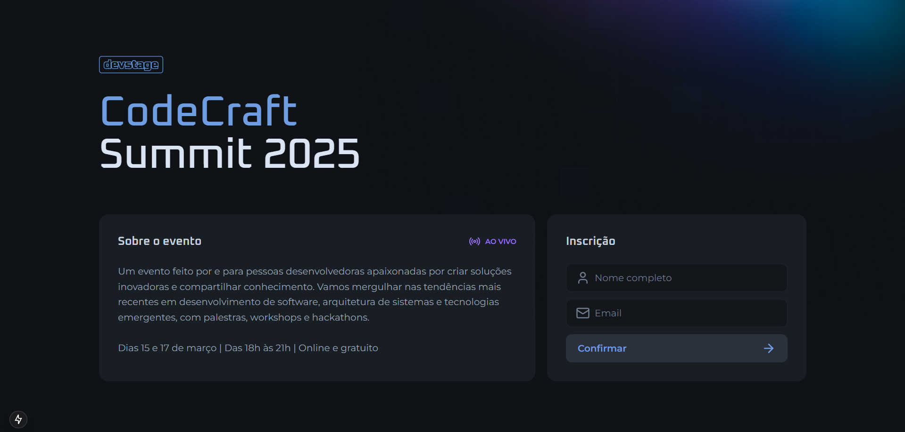
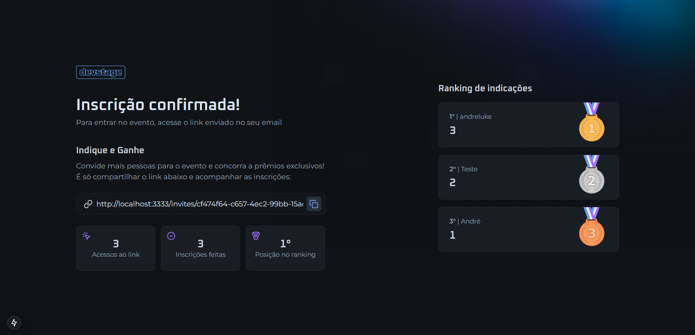

# NLW Connect - Front-End para Inscrições em Eventos

Este é o front-end desenvolvido com **Next.js 15**, **React 19** e **Tailwind CSS** para interagir com a API de inscrições em eventos. A aplicação permite o registro de participantes, exibição de rankings e acompanhamento de convites.

## 📁 Estrutura do Projeto

```bash
web/
├─ .github/workflows/         # Configuração de CI/CD
├─ .next/                     # Arquivos de build do Next.js
├─ .swc/plugins/              # Plugins do compilador SWC
├─ .vscode/                   # Configurações do VS Code
├─ public/                    # Arquivos estáticos
├─ src/
│  ├─ @types/                 # Definição de tipos TypeScript
│  ├─ app/                    # Estrutura de páginas do Next.js
│  ├─ assets/                 # Imagens e ícones
│  ├─ class/                  # Classes utilitárias
│  ├─ components/             # Componentes reutilizáveis
│  ├─ functions/              # Funções auxiliares
│  ├─ http/                   # Configuração da API
│  ├─ schemas/                # Schemas de validação com Zod
│  ├─ tools/                  # Funções auxiliares
│  └─ declarations.d.ts       # Declarações globais TypeScript
├─ .gitignore                 # Arquivo de exclusão do Git
├─ biome.json                 # Configuração do Biome
├─ jest.config.ts             # Configuração do Jest
├─ jest.setup.ts              # Configuração de ambiente de testes
├─ next-env.d.ts              # Definições para Next.js
├─ next.config.ts             # Configuração do Next.js
├─ orval.config.ts            # Configuração do Orval
├─ package.json               # Dependências do projeto
├─ tailwind.config.ts         # Configuração do Tailwind CSS
└─ tsconfig.json              # Configuração do TypeScript
```

## 🚀 Tecnologias Utilizadas

- **Next.js 15**: Framework React para aplicações server-side rendering e static generation.
- **React 19**: Biblioteca para construção da interface.
- **Tailwind CSS 4**: Framework de estilização baseado em utilitários.
- **React Hook Form**: Gerenciamento de formulários.
- **Zod**: Validação de dados.
- **Jest**: Testes automatizados.

## ⚙️ Instalação e Configuração

### Pré-requisitos

- [Node.js](https://nodejs.org/) instalado

### Passos para Rodar o Projeto

1. Clone o repositório:

   ```sh
   git clone https://github.com/andreluke/NLW-React
   cd NLW-React
   ```

2. Instale as dependências:

   ```sh
   npm install
   ```

3. Inicie o servidor de desenvolvimento:

   ```sh
   npm run dev
   ```

4. Acesse a aplicação:
   - A aplicação estará disponível em `http://localhost:3000`

## 🛠️ Comandos Disponíveis

| Comando            | Descrição                                    |
|--------------------|----------------------------------------------|
| `npm run dev`     | Inicia o servidor em modo desenvolvimento    |
| `npm run build`   | Compila o código para produção               |
| `npm run start`   | Inicia o servidor em produção                |
| `npm run lint`    | Executa a verificação de código com o Biome  |
| `npm run test`    | Executa os testes automatizados              |

## 🧪 Testes

Os testes utilizam **Jest** e estão localizados nos diretórios `src/class/test/` e `src/components/test/`. Para executá-los, utilize:

```sh
npm run test
```

## 📸 Prints

### Página Inicial



### Página de Convites



## 📜 Licença

Este projeto está sob a licença **ISC**.

---

🚀 **Desenvolvido com Next.js e Tailwind CSS para uma interface moderna e eficiente!**
